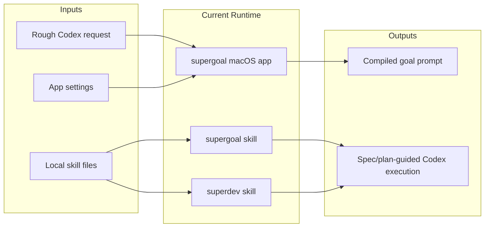
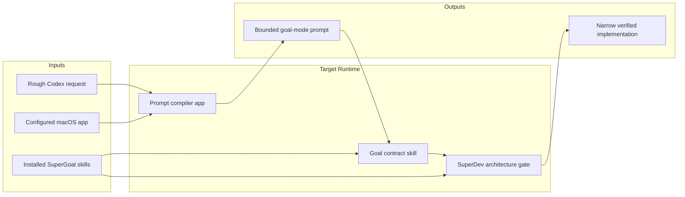

# SuperGoal Spec

SuperGoal packages two Codex skills and one macOS menu-bar app for stabilizing Codex goal-mode repository work.

## Scope

- In scope: `skills/supergoal`, `skills/superdev`, and `plugin/supergoal.app-src`.
- Out of scope: hosted services, prompt marketplaces, cloud sync, multi-user account systems, and unrelated Codex tooling.

## Current Architecture

## Target Architecture

## Repository Layout

- `skills/supergoal`: goal contract compiler skill.
- `skills/superdev`: spec/plan architecture gate skill.
- `plugin/supergoal.app-src`: macOS menu-bar app source.

## Data Contracts

- Skill entry points are `SKILL.md`.
- The app bundle identifier is `com.guowei.supergoal`.
- Release artifacts are zipped `.app` bundles uploaded to GitHub Releases.
