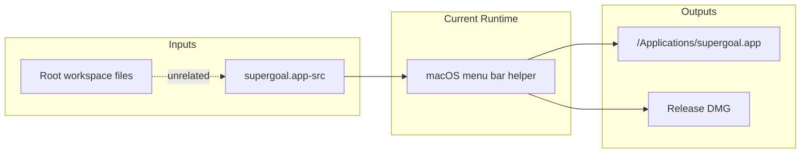
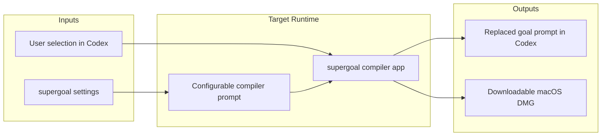

# testCodexClaudecode Spec

This repository contains small local experiments plus the durable `supergoal.app-src` macOS helper app and release packaging flow.

## Scope

- In scope: maintain the `supergoal.app-src` app as the current durable product surface.
- Out of scope: redesign unrelated root-level web/game files during supergoal app work.

## Current Architecture

## Target Architecture

## Main Boundaries

- `supergoal.app-src` owns macOS UI, settings, hotkey handling, prompt compilation, icons, installation scripts, and DMG packaging.
- Root files outside `supergoal.app-src` are not part of current supergoal feature work.
