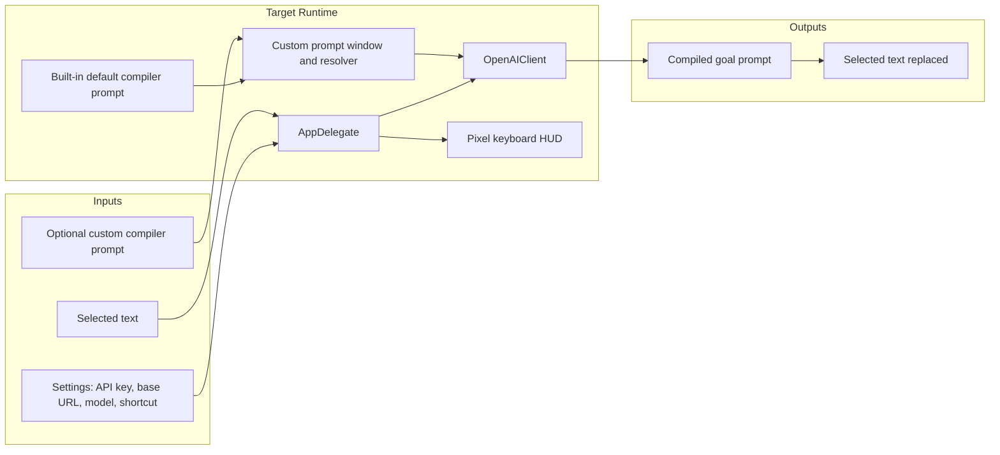

# supergoal.app-src Spec

`supergoal.app-src` builds a macOS menu bar helper that turns selected rough Codex requirements into a bounded goal prompt and replaces the selection in place.

## Scope

- In scope: menu bar UI, settings, global hotkey, prompt compilation request, prompt replacement, app icon assets, build/install scripts.
- Out of scope: prompt preset marketplace, prompt version history, multi-profile management, unrelated Codex automation features.

## Current Architecture

## Target Architecture

## Data Contracts

- API key is saved in `UserDefaults` under the existing `api-key` key.
- Base URL, model, and shortcut are saved in `UserDefaults` from Settings.
- Custom compiler prompt should be saved as plain text in `UserDefaults`.
- Empty or whitespace-only custom prompt means "use the built-in default compiler prompt."

## Interaction Boundaries

- Settings owns API key, base URL, model, and shortcut input and validation.
- The `Custom Compiler Prompt...` menu item owns custom prompt editing and validation.
- `AppDelegate` loads saved settings and passes resolved configuration to compile calls.
- `OpenAIClient` sends the effective compiler prompt as the system/instructions prompt.
