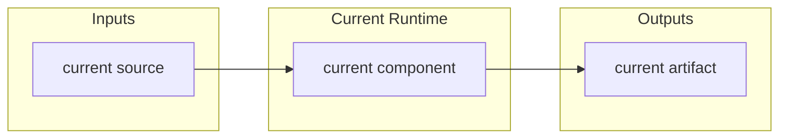
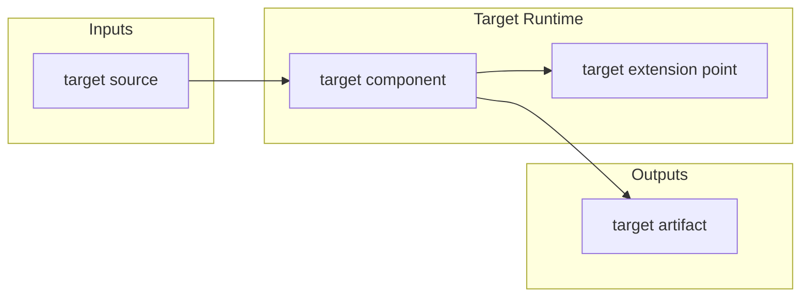

# SuperDev

## Core Rule

Use spec / plan driven development for durable work:

- Maintain root `SPEC.md` and `PLAN.md` for repository-wide architecture and execution state.
- Maintain `<module>/SPEC.md` and `<module>/PLAN.md` for every long-lived module.
- Require every substantial `SPEC.md` to include both `Current Architecture` and `Target Architecture` Mermaid diagrams.
- Do not begin substantial production implementation until the target Mermaid architecture is clear enough to guide the work.

Small one-off utilities, copy edits, typo fixes, and local experiments do not need new module docs unless they become durable subsystems.

## Development Gate

Before substantial code changes:

1. Identify whether the request touches repository-wide behavior, one long-lived module, or multiple modules.
2. Read the root `SPEC.md` and `PLAN.md` when they exist.
3. Read each relevant module's `SPEC.md` and `PLAN.md` when they exist.
4. Check whether each relevant `SPEC.md` has:
   - `Current Architecture` with a Mermaid diagram that matches the current implementation.
   - `Target Architecture` with a Mermaid diagram that matches the requested direction.
5. If docs are missing, stale, or unclear, update or discuss the docs first.

If `Target Architecture` is absent, vague, or inconsistent with the user's request, stop before production implementation. Ask for clarification or draft the target architecture update for review, depending on the user's desired level of autonomy.

## SPEC.md Requirements

Each substantial `SPEC.md` should answer:

- What problem does this repository or module solve?
- What is in scope and out of scope?
- What are the main concepts and boundaries?
- What is the current architecture?
- What is the target architecture?
- What data contracts, schemas, APIs, or file layouts matter?
- How does it interact with other modules?

Use this minimum architecture structure:

````md
## Current Architecture



## Target Architecture


````

Keep diagrams simple, horizontal, and truthful. `Current Architecture` is a map of reality, not a wish. `Target Architecture` is the current intended design, not an unbounded future vision.

## PLAN.md Requirements

Each substantial `PLAN.md` should answer:

- What is already done?
- What is partially done?
- What is not started?
- What is the recommended next step?
- Who owns each class of work?
- What are the acceptance criteria?
- What risks or open questions remain?
- What verification evidence supports completed items?

Recommended sections:

- `Current Status`
- `Milestones`
- `Next Steps`
- `Owners`
- `Acceptance Criteria`
- `Verification Log`
- `Risks / Open Questions`
- `Status Maintenance Rules`

## Keeping Docs In Sync

When the implementation changes architecture:

- Update `Current Architecture` to reflect the new code.
- Update `Target Architecture` if the intended direction changed or if the old target has been reached.
- Update `PLAN.md` completed work, remaining work, next steps, risks, acceptance criteria, and verification evidence.

When `SPEC.md` adds a concept, field, boundary, component, or phase, update `PLAN.md` so the execution state covers it. When `PLAN.md` marks work complete, make sure the code, docs, and verification evidence actually support that state.

## Working Behavior

Be proactive but respect the gate:

- If the target is clear, implement the change and update docs afterward.
- If the target is almost clear, make the smallest necessary SPEC/PLAN update first, then implement.
- If the target is materially unclear, do not write production code. Present the architecture question or propose a concrete `Target Architecture` diagram for approval.
- If the user explicitly asks only for planning, do not implement code.

This skill is about making architecture a live contract: current reality, target direction, implementation, and plan status should stay aligned.
